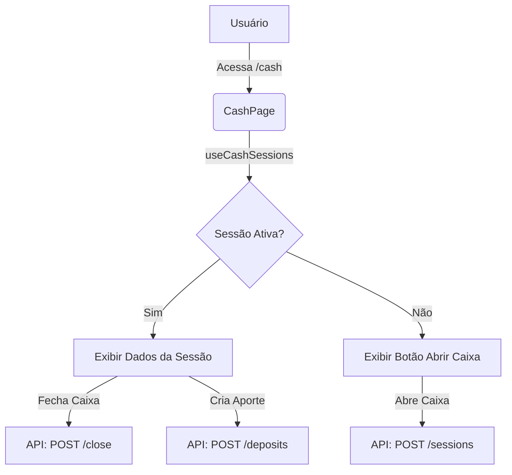

# Controle de Caixa - Implementação

## 📊 Visão Geral

O sistema de gerenciamento de caixa (cash register) está implementado e integrado ao backend, permitindo aos atendentes abrir, acompanhar vendas e fechar caixa com validação de saldo via API.

### ✅ Funcionalidades

1. **Abertura de Caixa**
   - Informar valor inicial em dinheiro
   - Observações opcionais
   - Validação via API (apenas 1 caixa aberto por vez por usuário/estabelecimento)

2. **Acompanhamento em Tempo Real**
   - Painel dedicado na rota `/cash`
   - Exibe valor de abertura e totais de vendas
   - Agrupamento de vendas por forma de pagamento
   - Histórico de aportes (sangrias/suprimentos)

3. **Fechamento de Caixa**
   - Informar valor real contado em dinheiro
   - Backend calcula automaticamente o esperado (Abertura + Vendas em Dinheiro + Aportes)
   - Validação de diferenças (sobra/falta)

4. **Gestão de Aportes**
   - Adicionar dinheiro ao caixa (suprimento/troco)
   - Listar aportes da sessão atual

5. **Integração Backend**
   - Dados persistidos em banco PostgreSQL
   - Suporte a turnos que atravessam a meia-noite
   - Cálculos seguros no servidor

---

## 📁 Estrutura do Código

### Tipos (`src/features/cash/types/index.ts`)
```typescript
- CashSession              → Sessão de caixa completa
- CashDeposit              → Aportes realizados
- CreateCashSessionDto     → Dados para abertura
- CloseCashSessionDto      → Dados para fechamento
```

### Serviço (`src/features/cash/services/cash-service.ts`)
Camada de integração com a API REST:
```typescript
- cashService.getAll()             → Histórico de sessões
- cashService.getActive()          → Sessão aberta atual do usuário
- cashService.create(dto)          → Abrir nova sessão
- cashService.close(id, dto)       → Fechar sessão
- cashService.createDeposit(...)   → Realizar aporte
- cashService.getDeposits(...)     → Listar aportes
```

### Hooks (`src/features/cash/hooks/use-cash-sessions.ts`)
Gerenciamento de estado com React Query:
- `useCashSessions()`: Hook unificado para acesso a dados e operações
- Gerencia cache e refetch automático após operações

### Componentes (`src/features/cash/components/`)

**`open-cash-form.tsx`**
- Formulário simples para início de turno
- Inputs: Valor inicial, Observações

**`close-cash-form.tsx`**
- Formulário de conferência
- Exibe apenas o valor esperado em **Dinheiro** (regra de negócio)
- Calcula diferença em tempo real

**`cash-summary-card.tsx`**
- Card principal do painel
- Ações rápidas: Fechar Caixa, Adicionar Aporte
- Resumo financeiro da sessão

**`cash-deposits-list.tsx`**
- Listagem de movimentações manuais de entrada de dinheiro

**`cash-payment-breakdown.tsx`**
- Gráfico/Lista de vendas agrupadas por método (Crédito, Débito, PIX, Dinheiro)

### Navegação
O recurso possui uma rota exclusiva e acessível via Menu Lateral e Bottom Bar:
- Rota: `/cash`
- Arquivo: `src/features/cash/pages/cash-page.tsx`

---

## 🎯 Regras de Negócio Importantes

### 💰 Conferência de Dinheiro
Diferente do total geral de vendas, o fechamento foca na conferência do **Dinheiro Físico**.
```
Esperado em Caixa = Abertura + Aportes + Vendas em Dinheiro
```
Vendas em Cartão ou PIX são registradas para somatório contábil, mas não afetam o saldo físico esperado na gaveta.

### 🛡️ Validações (Backend)
- Não permite abrir múltiplos caixas para o mesmo usuário/ponto.
- Não permite fechar caixa já fechado.
- Validar se data de fechamento é posterior à abertura.

---

## 🔄 Fluxo de Dados



## ✅ Status

**Status:** 🟢 **Em Produção**

O recurso está totalmente funcional, migrado de POC (LocalStorage) para integração completa com API Backend (.NET) e Banco de Dados.

