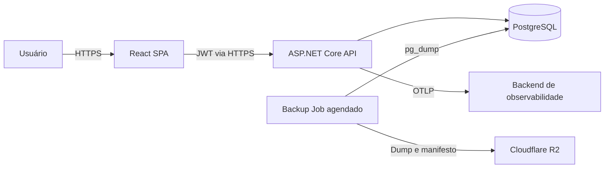

# Arquitetura

Este documento descreve a estrutura técnica atual. Consulte a [visão do produto](../product/overview.md) para escopo, o [modelo de domínio](../product/domain-model.md) para regras e os [ADRs](../adrs/README.md) para a motivação das principais escolhas.

## Contexto

Devlivery é um monorepo com dois processos de produto e um processo operacional:

## API

A composição ocorre em `Startup.cs`. As features ficam em `src/Devlivery/Features` e agrupam endpoint, comando ou consulta, validação e handler. O domínio em `Domain` permanece independente de HTTP e JWT. `Infrastructure` implementa persistência, autenticação, tenancy, observabilidade e representação HTTP.

O projeto usa Minimal APIs e o mediator gerado em compilação. EF Core atende escrita e consultas que precisam do tracking; Dapper está disponível para consultas diretas. Há dois contextos no mesmo PostgreSQL:

- `ApplicationDbContext`: dados de negócio e migrações da aplicação;
- `ApplicationIdentityDbContext`: tabelas do ASP.NET Core Identity no schema `identity`.

Ambos devem receber suas migrações em cada publicação.

## Autenticação e tenancy

O token JWT carrega `sub` e `establishment_id`. O middleware autentica a assinatura antes de registrar o tenant da requisição. Filtros globais do EF Core restringem entidades tenant-aware ao estabelecimento corrente.

Handlers que registram autoria resolvem o usuário do token no banco, dentro do tenant, e não confiam em identificadores enviados pelo frontend. O domínio recebe somente o identificador já resolvido.

## Eventos e consistência

Eventos de domínio são publicados pelo interceptor do EF Core durante `SaveChanges`. Os handlers de caixa decorrentes de pedidos executam dentro da requisição e recebem o contexto autenticado corrente. Se o processamento migrar para filas ou jobs, o autor e o tenant deverão ser transportados explicitamente no contrato do evento.

O banco é a fronteira de persistência compartilhada desta aplicação. Não há broker, cache distribuído ou limitador distribuído neste momento.

## Contratos HTTP

Respostas bem-sucedidas usam o envelope `data` e, quando aplicável, `meta`. Erros usam Problem Details com `title`, `status`, `detail` e erros de validação opcionais. O documento OpenAPI e o Scalar são expostos somente em desenvolvimento.

Os endpoints `/health` e `/alive` são públicos para a plataforma de hospedagem. `/health` verifica os dois contextos; `/alive` verifica somente o processo.

## Frontend

O frontend é uma SPA dividida por feature. TanStack Query controla o estado remoto, React Hook Form e Zod tratam formulários, e um serviço compartilhado centraliza a configuração HTTP, o token e a tradução de erros.

## Decisões e limites

- [ADR-001: monorepo e vertical slices](../adrs/0001-monorepo-and-vertical-slices.md)
- [ADR-002: tenant derivado do contexto autenticado](../adrs/0002-tenant-from-authenticated-context.md)
- [ADR-003: eventos de domínio síncronos](../adrs/0003-synchronous-domain-events.md)
- [ADR-004: contextos separados para negócio e identidade](../adrs/0004-separate-application-and-identity-contexts.md)

A API é um único processo de produto e compartilha um PostgreSQL entre as features. Não há broker, cache ou rate limiter distribuído. O job de backup é um processo separado e não participa das requisições do produto.
