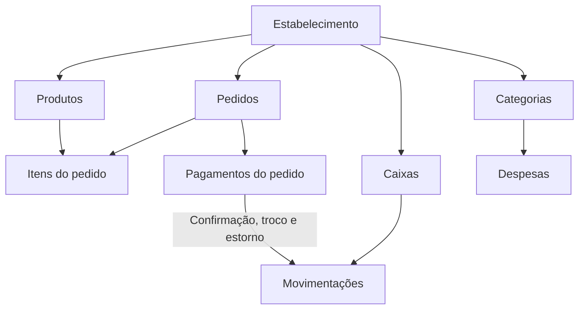
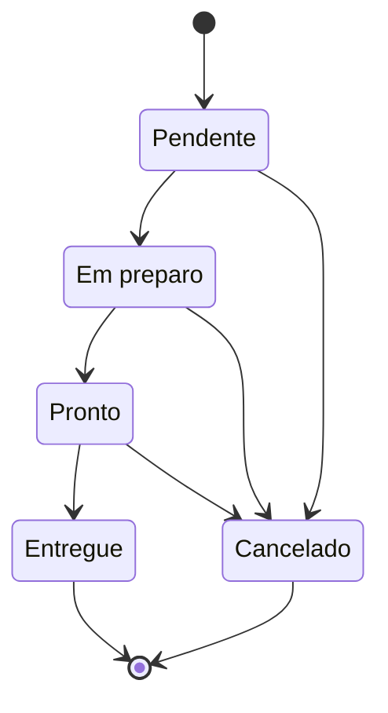

# Modelo de domínio

Este documento descreve o comportamento implementado no domínio e nos handlers da API. Nomes entre parênteses correspondem aos termos usados no código.

## Contexto e isolamento

Um **estabelecimento** (`Establishment`) é a fronteira do tenant. Produtos, pedidos, pagamentos, caixas, movimentações, despesas, categorias e usuários pertencem a um estabelecimento. O tenant vem da claim `establishment_id` do token autenticado e os filtros globais do EF Core restringem os dados da requisição.

A identidade do operador vem da claim `sub` e é resolvida no banco dentro do tenant. Comandos financeiros não devem aceitar o autor informado pelo cliente como fonte de verdade.

## Visão dos conceitos



O dashboard é uma capacidade de leitura sobre pedidos e despesas; ele não constitui um agregado de domínio.

## Produtos

O **produto** representa um item vendável do catálogo e possui nome, descrição, preço, categoria e disponibilidade. A indisponibilidade retira o produto da operação sem apagar seu histórico. Ao entrar em um pedido, o item mantém quantidade e preço unitário próprios; o total do pedido não depende de recalcular o preço atual do catálogo.

## Pedidos e pagamentos

Um **pedido** exige pelo menos um item e uma forma de pagamento. Seu total é a soma dos itens com a taxa de entrega, que não pode ser negativa. Cliente, endereço, itens, observações e taxa podem ser atualizados enquanto o fluxo permitir a operação.

Os estados disponíveis são:



Essa sequência representa o fluxo operacional. No comportamento atual, a API aceita a mudança direta entre estados não terminais: não há uma máquina de estados que obrigue a passagem por cada etapa. Um pedido cancelado não muda novamente; um pedido entregue também não retorna a outro estado.

Para entregar um pedido:

- a soma dos pagamentos não cancelados deve cobrir o total;
- pagamentos pendentes são confirmados;
- o troco é a diferença positiva entre pagamentos e total;
- eventos atualizam o caixa ativo durante a mesma requisição.

Pagamentos podem usar dinheiro, cartão de crédito, cartão de débito ou Pix. Um pagamento confirmado não pode ser alterado ou removido pela reconciliação do pedido; primeiro deve existir o tratamento de estorno. Pedidos entregues ou cancelados não aceitam novos pagamentos.

## Caixa

A **sessão de caixa** representa um expediente financeiro. Só pode existir uma sessão aberta por estabelecimento. Ela registra o operador autenticado responsável pela abertura, o valor inicial e as movimentações.

As movimentações implementadas são:

- **pagamento:** criado quando um pagamento do pedido é confirmado;
- **troco:** criado uma vez por pedido, quando existe pagamento em dinheiro e diferença positiva;
- **estorno:** compensa pagamentos associados a pedido cancelado ou excluído;
- **aporte:** entrada manual no caixa, vinculada ao operador autenticado.

Pagamentos, trocos e estornos são idempotentes pelas referências de pedido ou pagamento. Se não houver caixa ativo no momento em que o evento for tratado, a movimentação não é registrada e o fato é enviado ao log; não há fila para reprocessamento.

O valor esperado em dinheiro é:

```text
valor de abertura + aportes + pagamentos em dinheiro - estornos em dinheiro - trocos
```

O fechamento registra o valor contado e encerra a sessão. Uma sessão fechada não recebe pagamentos, trocos ou estornos. Consulte [segurança do login e do caixa](../operations/login-and-cash-security.md) para autoria e proteção de acesso.

## Despesas

Uma **despesa** pertence a uma categoria, tem valor positivo, vencimento e, opcionalmente, fornecedor, descrição e data de pagamento. Informar a data de pagamento na criação torna a despesa paga; sem essa data, ela nasce pendente.

Estados e transições relevantes:

- pendente pode ser marcada como paga ou cancelada;
- paga mantém uma data de pagamento e pode voltar a pendente por estorno;
- paga não pode ser cancelada diretamente;
- cancelada não pode ser paga nem editada;
- a data de pagamento só pode ser corrigida enquanto a despesa está paga;
- atraso e vencimento no dia são classificações calculadas para despesas pendentes.

Categorias podem conter subcategorias. Uma subcategoria não pode ser associada simultaneamente a mais de uma categoria.

## Consistência entre áreas

Eventos de domínio conectam pedidos e caixa sem tornar o agregado de pedido responsável pelo ledger financeiro. O processamento é síncrono e depende do tenant e do operador da requisição corrente. Veja [ADR-003](../adrs/0003-synchronous-domain-events.md) para as consequências dessa escolha.

Ao alterar uma regra descrita aqui, atualize o documento no mesmo pull request e acrescente testes no nível indicado pela [estratégia de testes](../development/testing-strategy.md).
